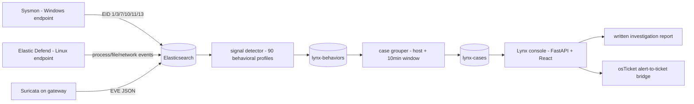

# SOCAtelier

A home SOC lab I built to practice the L1 loop end to end: take logs in,
find the bad stuff, work the case, write it up. Everything runs on one
machine with Docker; nothing here needs a second PC or a paid license.

## Screenshots

All captured from the live console on 30/09/2026:

- [Case queue](screenshots/01-Case_Queue.png) - 10 open cases with risk and severity
- [Case selected - process tree](screenshots/02-Case_Selected_Process_Tree.png)
- [Cross-layer corroboration](screenshots/03-Cross_Layer.png) - EDR behavior confirmed by gateway flows
- [Live Linux case](screenshots/04-Live_Linux_Case.png) - real telemetry from this machine
- [Hunt workbench](screenshots/05-Hunt_Workbench.png)
- [Coverage map](screenshots/06-Coverage_Map.png)
- [Action log](screenshots/07-Action_Log.png)

## What is inside

- Elasticsearch + Kibana as the SIEM core
- Suricata on the gateway for network detection (lab rule SID 9000077 for
  internal RFC1918 SYN sweeps, which the stock ET ruleset ignores)
- Sysmon (Windows) and Elastic Defend (Linux) endpoint telemetry
- Lynx, my investigation console (FastAPI + React): case queue, process
  trees, cross-layer timeline, hunt templates, analyst action trail
- osTicket as the alert-to-ticket bridge — the same loop a real SOC L1
  works every day (see IR-007)

## Detection content

- 97 Sysmon detection rules mapped to MITRE ATT&CK
  (detection-rules/lynx-detection-rules.ndjson)
- 18 Sigma rules, portable versions of the same detections (sigma-rules/)
- detections exercised with Atomic Red Team runs

## Incident reports

investigation-reports/ has eleven write-ups: six Windows cases
(case-IR-001..006), the osTicket workflow (IR-007), and four Linux runs
(LIR-001..004). Each one follows a single alert from detection to the
full kill chain, correlates EDR and NDR telemetry, and ties every step to
its ATT&CK technique.

## Data notes (read this before judging the repo)

- The Linux cases are live: the commands really ran on this machine and
  the recorder captured real processes, pids and timestamps.
- The Windows cases are archived replays of earlier lab runs: stored JSON
  re-imported into Elasticsearch. Raw Sysmon event bodies were not
  archived, so the console rebuilds process trees from the persisted
  behavior records. Every Windows report says so.
- All of it is a controlled simulation. No real victims, no real
  infrastructure.

## Running it

```bash
cd docker/elastic
docker compose up -d          # Elasticsearch + Kibana
python3 lynx/import_datasets.py   # replay stored cases
python3 lynx/server.py               # Lynx API on :8000
cd lynx/frontend-react && npm run dev   # console on :5173
```

The console works fully offline: case summaries and briefings are
deterministic, no AI service required.

## Data flow



1. Two independent telemetry paths land in Elasticsearch: endpoint (Sysmon
   on Windows, Elastic Defend on Linux) and network (Suricata EVE JSON).
2. The detector turns raw events into behaviors; the grouper bundles them
   into cases.
3. The console is where triage happens, and the reports and tickets are
   the written output of that triage.
