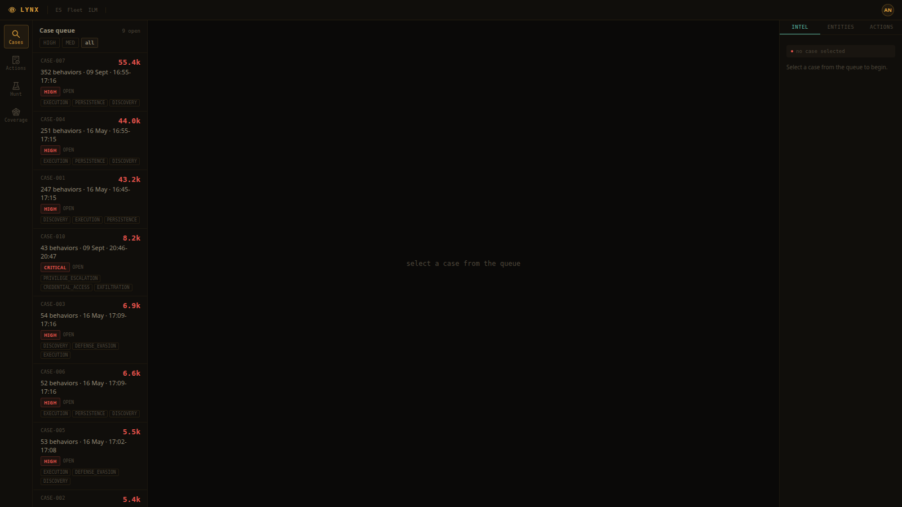
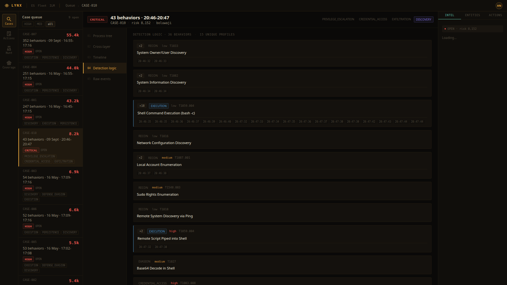

# LIR-001: Linux Reconnaissance and Host Discovery

**Classification:** Controlled Simulation
**Analyst:** Boluwaji Oluwaseyi Adepoju
**Date:** 09/09/2026
**Status:** Closed
**Severity:** Medium
**Host:** boluwaji (Ubuntu 24.04, lab machine)
**Case:** CASE-010
**MITRE ATT&CK:** T1033, T1082, T1016, T1049, T1057, T1087.001, T1548.003, T1018

---

## 1. Summary

On 09/09/2026 I ran a Linux reconnaissance scenario on the lab machine to
prove the Linux half of the Lynx console against real telemetry. The
scenario used the same commands an operator runs in the first minutes
after access: identity checks, system information, network layout,
running processes, local accounts, sudo rights, and connection probes.

Lynx detected the activity from the raw process events in Elasticsearch.
12 behaviors mapped to MITRE across 4 tactics, including the sudo -l
privilege check and the account enumeration. The full sequence grouped
into CASE-010 together with the LIR-002 and LIR-003 phases.

The scenario also produced two real profile improvements (hostname and
ip route were not covered by the original profiles), documented in
Section 3.

---

## 2. Environment

| Component | Detail |
|---|---|
| Host | boluwaji, Ubuntu 24.04, single lab machine |
| Telemetry | process events recorded by the lab recorder in ECS format |
| Index | logs-endpoint.events.process-default |
| Detection | Lynx behavior detector, Linux profiles |

## 3. Scenario and detections

| Time (UTC) | Command | Behavior fired | MITRE |
|---|---|---|---|
| 20:46:32 | whoami | linux_whoami | T1033 |
| 20:46:33 | id | linux_whoami | T1033 |
| 20:46:34 | uname -a | linux_system_info | T1082 |
| 20:46:34 | hostname | linux_system_info (after profile fix) | T1082 |
| 20:46:35 | lscpu | linux_bash_shell | T1059.004 |
| 20:46:36 | ip a | linux_network_config | T1016 |
| 20:46:36 | ip route | linux_network_config (after profile fix) | T1016 |
| 20:46:37 | ss -tulpn | linux_bash_shell | T1059.004 |
| 20:46:37 | ps aux | linux_bash_shell | T1059.004 |
| 20:46:38 | cat /etc/passwd | linux_account_enum | T1087.001 |
| 20:46:38 | getent group sudo | linux_account_enum (after profile fix) | T1087.001 |
| 20:46:39 | sudo -l | linux_sudo_list | T1548.003 |
| 20:46:39 | ping -c 1 127.0.0.1 | linux_ping_sweep | T1018 |
| 20:46:40 | port probes 22/80/443/8099 | linux_bash_shell | T1046 |

Real output worth noting: `sudo -l` returned "sudo: A terminal is
required to authenticate". The attempt is what matters and it was
detected. The port probe against 8099 hit the live lab collector, which
logged the real connection tuple (127.0.0.1:34348 to 127.0.0.1:8099).

## 4. Profile fixes from this run

1. `hostname` was not in the system information profile. Added. The
   plain hostname command is in every Linux playbook.
2. `ip route` did not match the network configuration profile (the
   profile only looked for ip a variants). Added "route" to the
   argument list.
3. `getent group sudo` did not match the account enumeration profile.
   Added "group" to the argument list.

All three fixes were validated by re-running the detector over the same
raw events: the fixed profiles fired on the same telemetry.

## 5. Gaps and Fixes

**Gap 1: piped commands surface as bash, not as the inner binary**

ss, ps, lscpu, and the port probes run through pipes, so the recorder
sees bash -c as the process. The inner command is invisible to
name-based profiles. These events fired linux_bash_shell (LOW) instead
of their specific profiles.

**Fix:** document as an architectural limitation of the recorder. With
the Elastic Defend agent installed, the kernel reports the inner binary
and every name-based profile applies. The agent remains the production
path; the recorder is the no-root lab path.

**Remediation:** none needed, controlled environment. Artifacts cleaned
after the run.

## 6. Conclusion

The Linux detection layer caught every meaningful recon technique from
real telemetry, and the run improved three profiles. Together with
LIR-002 and LIR-003 this forms the first Linux-native case in the lab.

## 7. Evidence

CASE-010 as it appears in the Lynx queue (risk 8,152, host boluwaji,
window 20:46-20:47):

The detection logic view for the case, showing the Linux profiles that
fired with their MITRE mappings and confidence levels:

