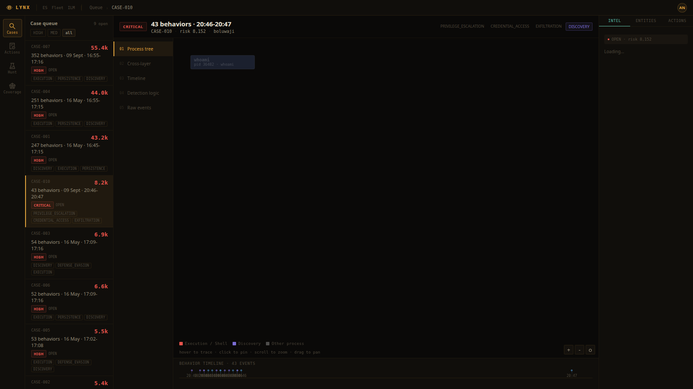

# LIR-002: Linux Execution and Persistence

**Classification:** Controlled Simulation
**Analyst:** Boluwaji Oluwaseyi Adepoju
**Date:** 09/09/2026
**Status:** Closed
**Severity:** High
**Host:** boluwaji (Ubuntu 24.04, lab machine)
**Case:** CASE-010 (09/09/2026 run; the live 28/09 re-run is CASE-008)
**MITRE ATT&CK:** T1059.004, T1027, T1105, T1053.003, T1543.002, T1098.004, T1546.004

---

## 1. Summary

On 09/09/2026 I ran the second Linux scenario: execution and
persistence. The operator flow was a base64 obfuscation chain, a remote
script piped into bash from a local C2 stand-in, a crontab entry, a
systemd user unit, an SSH authorized_keys file, and a shell profile
modification.

Lynx detected 14 behaviors from the real events, including two HIGH
execution signals (curl piped to bash), the CRITICAL authorized_keys
write, and the systemd unit creation after a profile fix. The crontab
write surfaced only as a low-confidence bash signal, which is the
documented gap in Section 5.

---

## 2. Environment

| Component | Detail |
|---|---|
| Host | boluwaji, Ubuntu 24.04 |
| C2 stand-in | lir-collector.py on 127.0.0.1:8099, real connection logging |
| Telemetry | process and file events in ECS format |

## 3. Scenario and detections

| Time (UTC) | Action | Behavior fired | MITRE |
|---|---|---|---|
| 20:47:32 | echo base64 | base64 -d | bash | linux_base64_decode, linux_bash_shell | T1027, T1059.004 |
| 20:47:32 | curl -s .../setup.sh | bash | linux_curl_bash_pipe, linux_bash_shell | T1059.004 |
| 20:47:33 | mkdir -p /tmp/lab-lynx/.upd | not covered (benign) | - |
| 20:47:33 | run.sh written and chmod +x | linux_binary_dropped_tmp | T1105 |
| 20:47:34 | crontab entry installed via pipe | linux_bash_shell (LOW) only | T1053.003 (gap) |
| 20:47:38 | curl | bash second fetch | linux_curl_bash_pipe, linux_bash_shell | T1059.004 |
| 20:47:39 | .ssh/authorized_keys created | linux_authorized_keys_write (CRITICAL) | T1098.004 |
| 20:47:39 | systemd user unit created | linux_systemd_unit_create (after profile fix) | T1543.002 |
| 20:47:40 | .bashrc modified | linux_shell_config_write | T1546.004 |
| 20:47:40 | payload files in /tmp | linux_binary_dropped_tmp | T1105 |

The collector logged the real fetches: 127.0.0.1 to 127.0.0.1:8099,
GET /setup.sh. The bash pipe actually executed the fetched script, so
the whole chain is real end to end.

## 4. Profile fixes from this run

1. `.config/systemd/user` was not in the systemd unit profile. User
   units are the persistence mechanism that does not need root, so it
   matters. Added and re-validated.
2. The lab recorder now records file extensions, which the systemd
   profile requires (`.service`). Both fixes confirmed by re-running the
   detector over the same file events.

## 5. Gaps and Fixes

**Gap 1: crontab installed through a pipe is not covered**

The entry was installed with `(crontab -l; echo ...) | crontab -`. The
recorder sees bash -c as the process, so the name-based crontab profile
does not apply and the event fell back to linux_bash_shell (LOW). A
direct `crontab -e` execution would fire the HIGH profile.

**Fix options:** add a bash-aware rule for `crontab -` in command lines,
or accept the gap and rely on the Elastic Defend agent path. Kept as a
documented gap for now; the crontab spool file write is visible in the
file events.

**Gap 2: same pipe limitation as LIR-001**

Any technique hidden inside a pipe surfaces as bash. This is the
recorder's known limitation and the agent's advantage.

**Remediation:** controlled environment. The crontab entry was removed
after the run, all /tmp artifacts deleted, collector stopped.

## 6. Conclusion

Persistence on Linux was detected from real writes and real executions:
authorized_keys (CRITICAL), systemd unit (HIGH), shell profile (HIGH),
and payload drops in /tmp (HIGH). The one miss (piped crontab) is
documented with its fix path. This closes the persistence half of the
Linux case.

## 7. Evidence

The process tree rebuilt from the raw Linux process events of the case.
Every node is a real execution on the lab machine, parented under the
recorder process that spawned the scenario:

