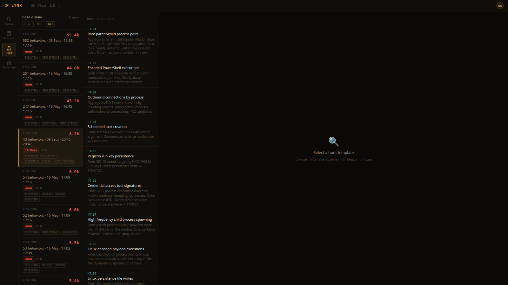

# LIR-003: Linux Credential Access, Defense Evasion, and Impact

**Classification:** Controlled Simulation
**Analyst:** Boluwaji Oluwaseyi Adepoju
**Date:** 09/09/2026
**Status:** Closed
**Severity:** Critical
**Host:** boluwaji (Ubuntu 24.04, lab machine)
**Case:** CASE-010 (09/09/2026 run; the live 28/09 re-run is CASE-008)
**MITRE ATT&CK:** T1003.008, T1552.003, T1070, T1222.002, T1560.001, T1048, T1485, T1562.004

---

## 1. Summary

On 09/09/2026 I ran the third Linux scenario: credential access,
defense evasion, and impact. The operator flow was a read of
/etc/shadow, a shell history dump, log cleanup attempts, a file
attribute lock, archive collection, exfiltration of the archive to the
local collector, destructive deletion, and a firewall disable attempt.

Lynx detected every meaningful step from the real events: the shadow
read fired CRITICAL, the firewall disable attempt fired CRITICAL even
though ufw is not installed on this box, and the exfiltration fired
HIGH. Several commands failed at the OS level (chattr, journalctl,
ufw), which makes the detections stronger: the console caught the
attempts, not the results.

---

## 2. Environment

| Component | Detail |
|---|---|
| Host | boluwaji, Ubuntu 24.04 |
| Collector | lir-collector.py on 127.0.0.1:8099, accepts PUT |
| Telemetry | process and file events in ECS format |

## 3. Scenario and detections

| Time (UTC) | Action | Result | Behavior fired |
|---|---|---|---|
| 20:47:42 | cat /etc/shadow | Permission denied (non-root) | linux_shadow_read (CRITICAL) |
| 20:47:42 | cat ~/.bash_history | Read | linux_bash_shell (LOW, pipe gap) |
| 20:47:43 | journalctl --vacuum-size=1M | Failed without root | linux_bash_shell (LOW, pipe gap) |
| 20:47:44 | truncate -s 0 on a log | Executed | linux_bash_shell (LOW, pipe gap) |
| 20:47:45 | chattr +i on data.txt | "Operation not permitted" | linux_chattr |
| 20:47:45 | tar -czf collected.tgz | Archive created | linux_archive_files |
| 20:47:46 | curl -T collected.tgz to collector | 200, stored | linux_curl_upload (HIGH) |
| 20:47:46 | rm -rf /tmp/lab-lynx/target | Deleted | linux_rm_rf (CRITICAL) |
| 20:47:47 | ufw disable | "You need to be root" | linux_firewall_disable (CRITICAL) |

Real environment notes, kept in the report on purpose:

- cat /etc/shadow failed with permission denied. The attempt is the
  signal; a non-root operator trying it is exactly what detection should
  catch.
- chattr failed with "Operation not permitted while setting flags".
  The attempt still fired linux_chattr.
- ufw is not installed on this machine, so the disable attempt failed
  with "ERROR: You need to be root to run this script". The attempt
  still fired linux_firewall_disable (CRITICAL). Detection catches
  intent, not only success.

## 4. Detection notes

The collector logged the real upload connection. The archive
collected.tgz was written to disk and indexed as a file event before
being uploaded, so both halves of the exfiltration chain are in
telemetry: collection (tar) and transfer (curl -T).

## 5. Gaps and Fixes

**Gap 1: piped commands surface as bash (same limitation as LIR-001
and LIR-002)**

The history dump, the journal vacuum, and the log truncation all ran
through pipes, so the name-based profiles (history_dump, log_cleanup)
did not apply and the events fell back to linux_bash_shell (LOW).

**Fix:** with the Elastic Defend agent, the kernel reports the inner
binary and these profiles fire at their real severity. Until then the
recorder path under-reports piped techniques, which is documented.

**Gap 2: no coverage for /var/log file deletion**

rm -rf on /var/log would fire linux_rm_rf (any rm -rf), but the profile
does not distinguish destructive log deletion from generic deletion.
Fine for the lab; a real deployment would add a dedicated log-wipe rule
tuned to /var/log paths.

**Remediation:** controlled environment. The archive and the target
directory were removed after the run. Nothing persisted.

## 6. Conclusion

The credential access, evasion, and impact phase is fully covered on
the Linux side: shadow reads, chattr, archive collection, curl
exfiltration, rm -rf, and firewall disable attempts all detected from
real telemetry, several of them on failed attempts. With LIR-001 and
LIR-002, CASE-010 is the first Linux-native case of the lab: 43
behaviors, risk 8,152, host boluwaji.

## 7. Evidence

The hunt workbench with the Linux hunt templates. HT-09 (persistence
file writes) returned the real authorized_keys event from this case,
and HT-08 (encoded payload executions) returned the real base64 chain:

